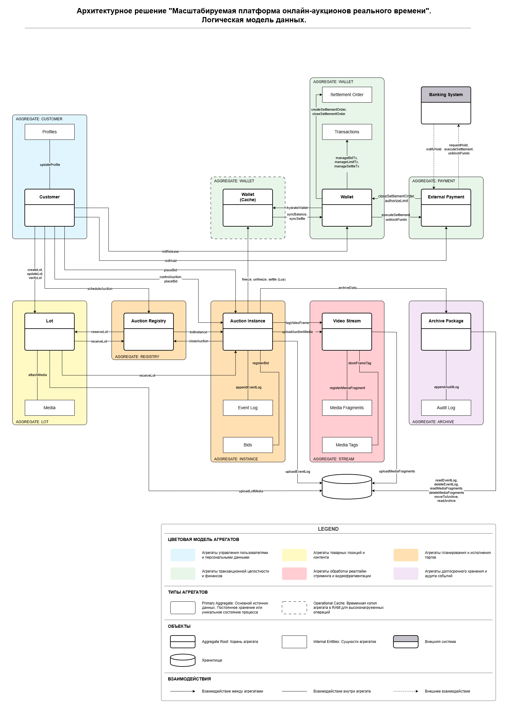
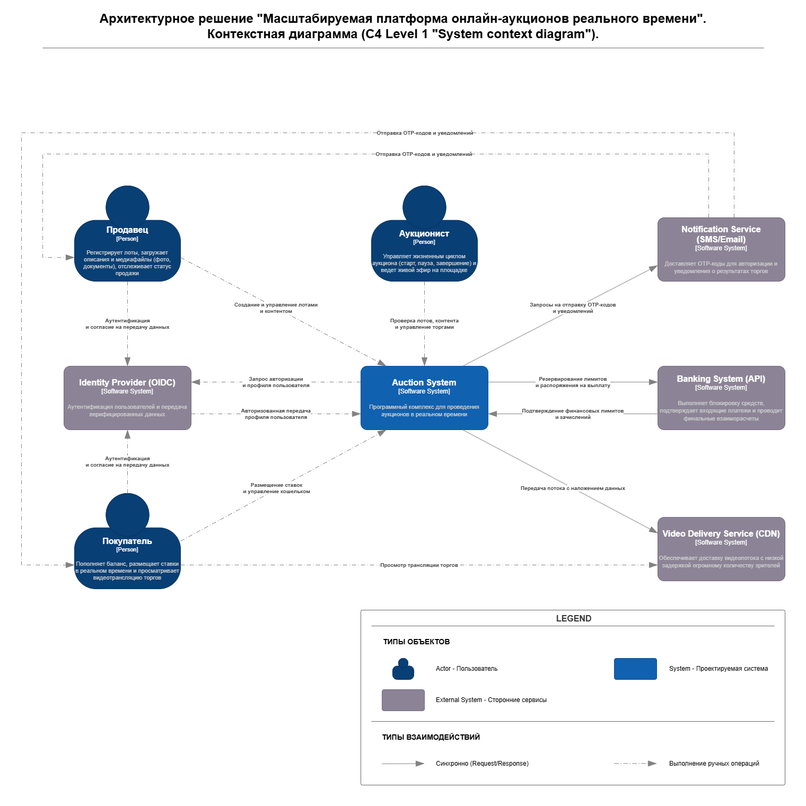
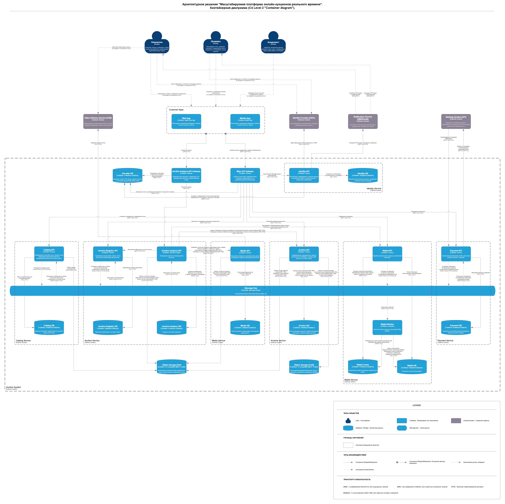
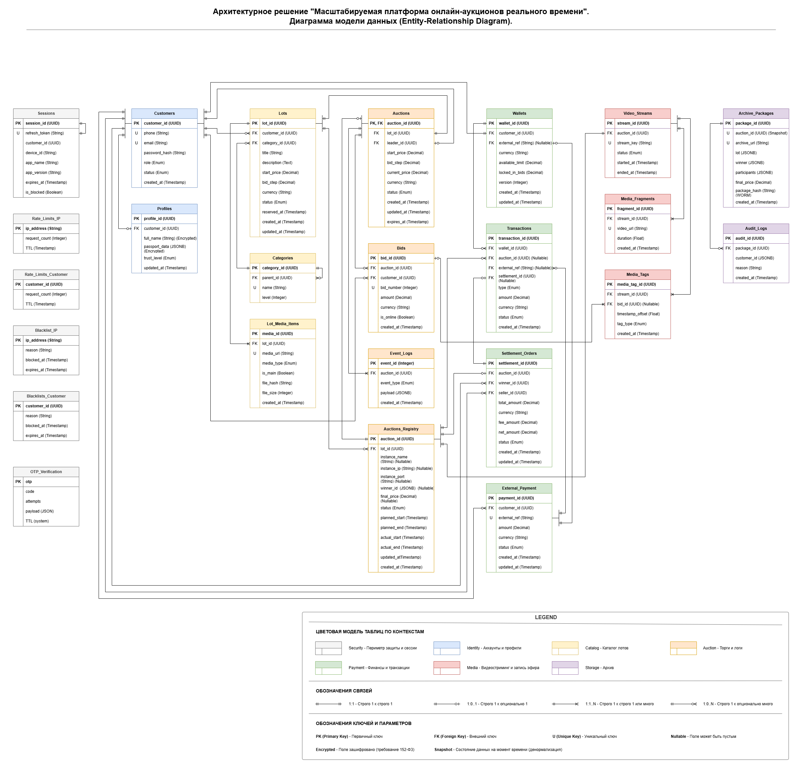
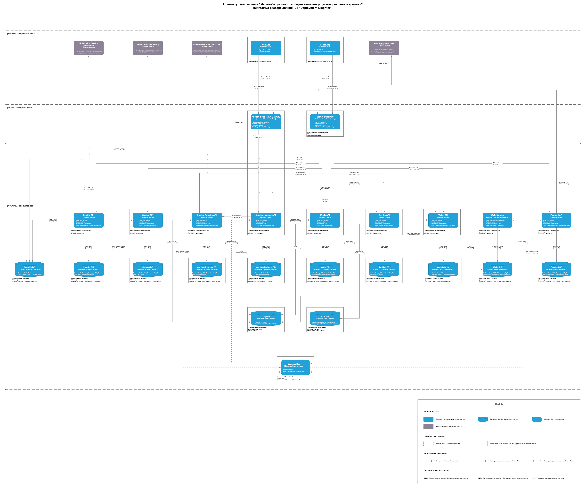
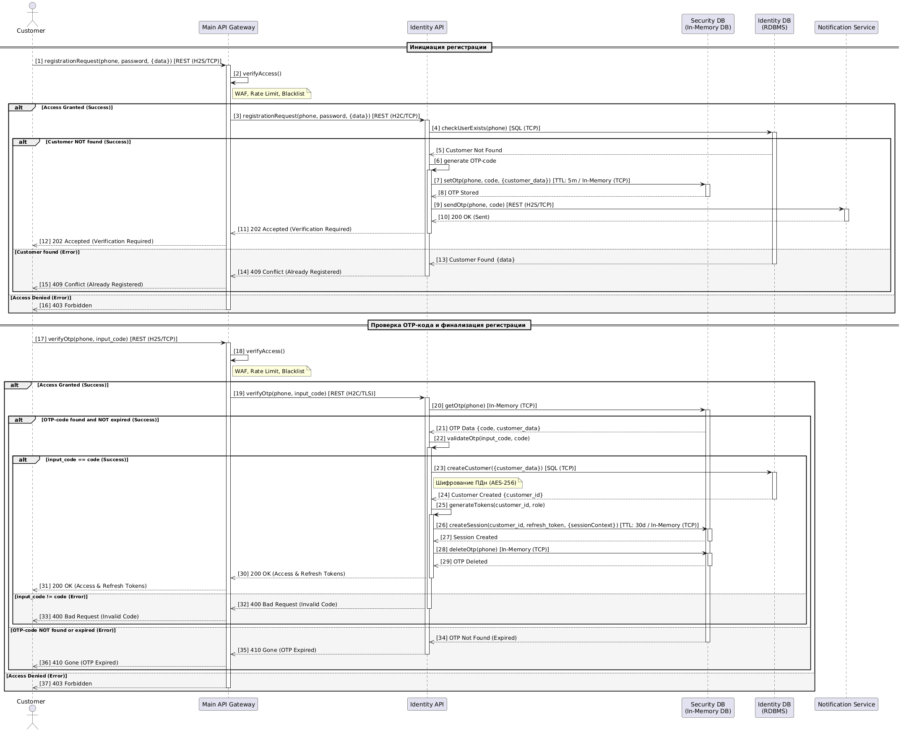
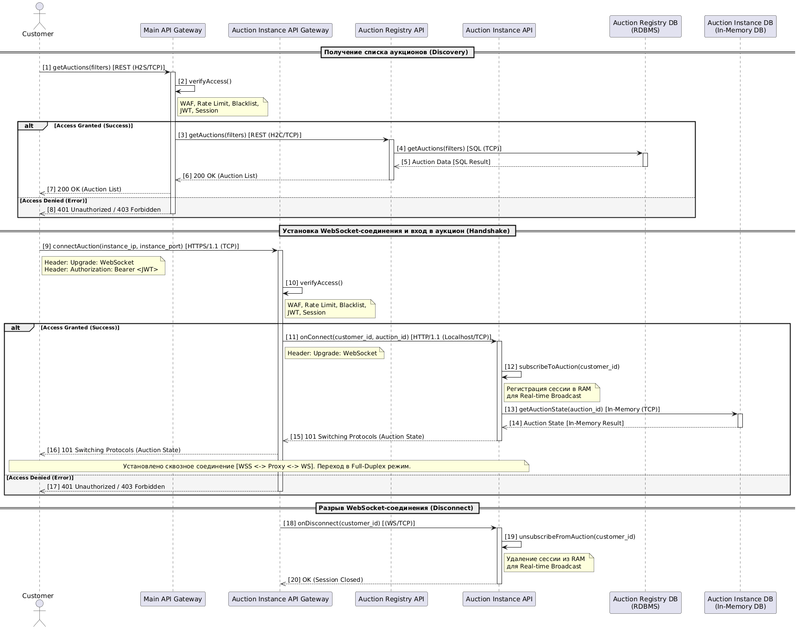
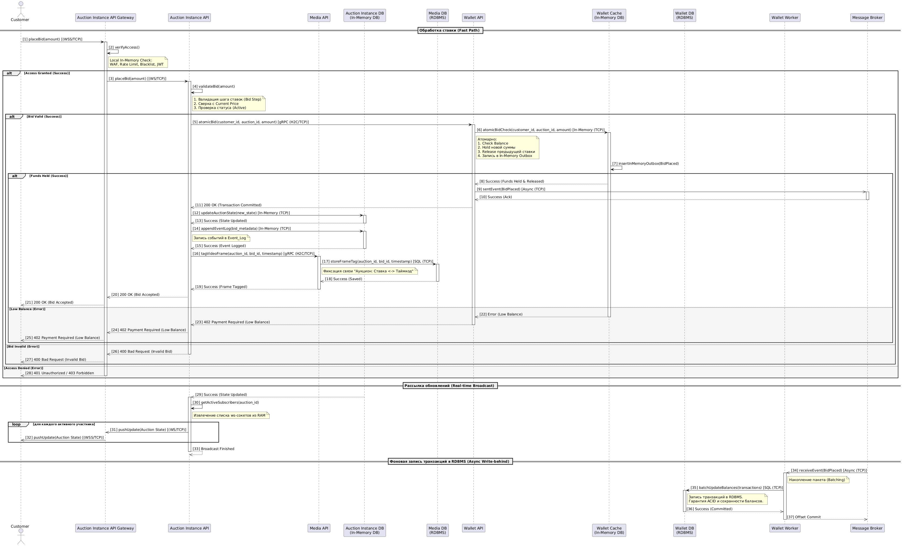
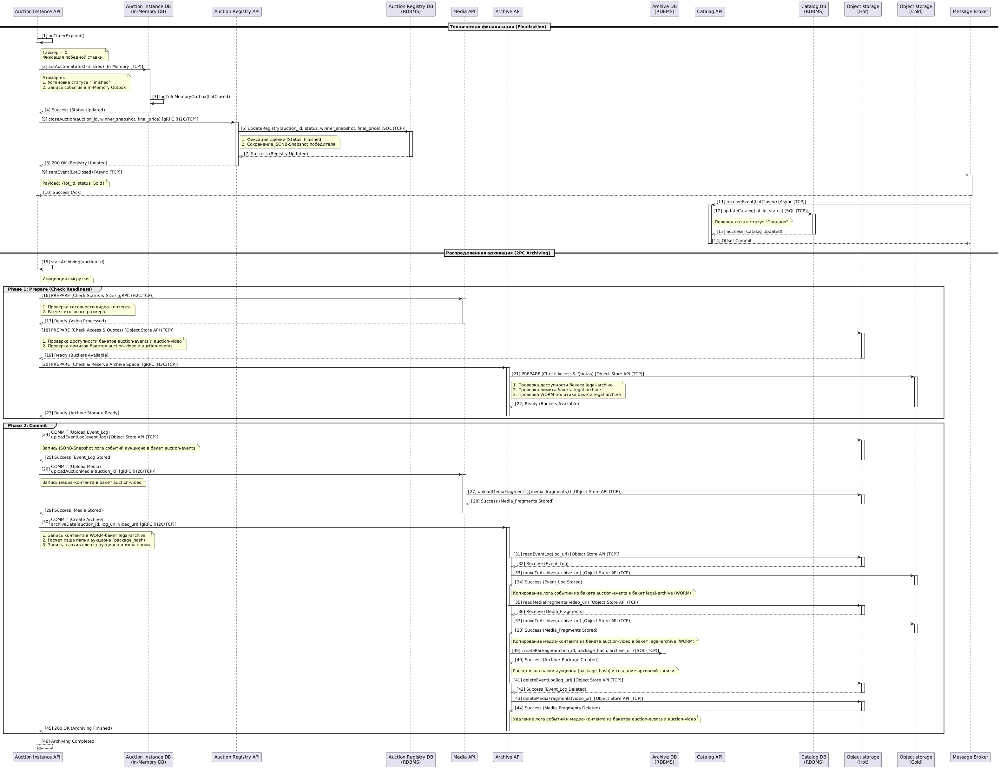
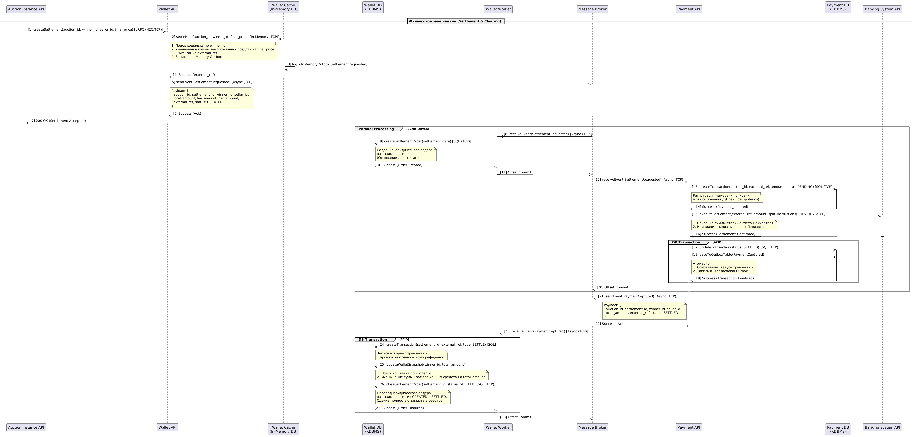

# Архитектурное решение "Масштабируемая платформа онлайн-аукционов реального времени"

## Содержание

1. [Описание проблемы](#problem-background)  
    1.1. [Бизнес-контекст](#business-context)  
    1.2. [Бизнес-цели](#business-goals)  
    1.3. [Архитектурные драйверы](#architectural-drivers)  
    1.4. [Ограничения технологические и бизнесовые](#tech-and-business-constraints)  
2. [Описание требований](#system-requirements)  
    2.1. [Функциональные требования](#functional-requirements)  
    2.2. [Стейкхолдеры и их потребности](#stakeholders-and-needs)  
    2.3. [Пользовательские сценарии](#user-stories)  
    2.4. [Критические сценарии и их характеристики](#critical-scenarios)  
    2.5. [Оценка атрибутов качества на основании критичных сценариев](#quality-attributes-assessment)  
3. [Описание решения](#architecture-solution)  
    3.1. [Функциональная структура предметной области](#domain-functional-structure)  
    3.2. [Функциональная декомпозиция по технической структуре](#technical-functional-decomposition)  
    3.3. [Область действия и контекст системы](#system-scope-and-context)  
    3.4. [Диаграмма контейнеров](#containers-diagram)  
    3.5. [Декомпозиция слоя данных](#data-layer-decomposition)  
    3.6. [Диаграмма развертывания](#deployment-diagram)  
    3.7. [Диаграммы последовательности для пользовательских сценариев](#sequence-diagrams)  
4. [Лог архитектурных решений (ADL, ADR)](#architecture-decision-log)  
    4.1. [ADR-001: Использование WebSockets](#adr-001)  
    4.2. [ADR-002: Динамическая оркестрация инстансов через k8s](#adr-002)  
    4.3. [ADR-003: Паттерн Transactional Outbox](#adr-003)  
    4.4. [ADR-004: Вынос СУБД и шины сообщений на Bare-Metal](#adr-004)  
    4.5. [ADR-005: Паттерн Write-Behind](#adr-005)  
    4.6. [ADR-006: Использование gRPC](#adr-006)  
    4.7. [ADR-007: Внедрение Sidecar-прокси](#adr-007)  

----

## 1. Описание проблемы

### 1.1. Бизнес-контекст

* Пользователи: покупатель, продавец, аукционист 
* Контекст:
    * Компания проводит только оффлайн аукционы.
    * Компания работает на региональном уровне.
* Дополнительный контекст:
    * Компания активно расширяется, объединяясь с более мелкими конкурентами.
    * Бюджет не ограничен.
    * Компания только что вышла из судебного процесса, где урегулировала иск по обвинению в мошенничестве.

### 1.2. Бизнес-цели

1.	Выйти с регионального на общенациональный уровень, а в перспективе на международный уровень.
1.	Увеличить количество участников одного аукциона до сотен участников, а в перспективе до тысяч участников.
1.	Увеличить количество одновременно проводимых аукционов до максимально возможного количества.
1.	Минимизировать, а желательно исключить, причины судебных исков по обвинению в мошенничестве.
1.	Иметь доказательства соблюдения правил проведения аукционов на случай судебных исков по обвинению в мошенничестве.

### 1.3. Архитектурные драйверы

1.	Изоляция рисков и нагрузок
    * Требование: Максимальное количество одновременных аукционов с тысячами участников.
    * Решение: Использование эфемерных инстансов аукционов. Сбой или перегрузка в одном инстансе не отражается на других.
1.	Юридическая доказательность
    * Требование: Исключение мошенничества и хранение истории 3 года для судов.
    * Решение: Внедрение неизменяемого списка событий и синхронизация времени между логом и видео.
1.	Гарантия финансовых обязательств
    * Требование: 100% уверенность в оплате выигранного лота.
    * Решение: Заморозка средств в кошельке при каждой ставке. Ставка не фиксируется в аукционе, пока в кошельке не будет заморожена транзакция.
1.	Минимизация отклика аукционов и обеспечение real-time
    * Требование: Обработка ставки за 50 мс и обмен событиями между приложениями и аукционом за 200 мс.
    * Решение: Использование резидентной БД для инстансов аукционов и управления ставками, протокола WebSocket для взаимодействий между приложениями и аукционом.
1.	Гарантия сохранения доказательной базы
    * Требование: Обеспечение гарантированного сохранения событий и видеозаписей проводимых аукционов перед удалением инстансов аукционов.
    * Решение: Использование 2PC при записи логов и видео в хранилище.

### 1.4. Ограничения технологические и бизнесовые
1.	Бизнес-ограничения
    * Региональная специфика и гибридная модель: Система обязана поддерживать совместную работу онлайн-интерфейсов и физического оборудования в залах (камеры, пульты аукциониста).
    * Репутационный комплаенс: Любое техническое решение должно проходить фильтр «юридической прозрачности», исключая возможность несанкционированной модификации истории событий.
    * Высокая скорость тиражирования: Архитектура должна обеспечивать быстрое развертывание платформы на инфраструктуре поглощаемых региональных конкурентов без изменения ядра системы.
1.	Технологические ограничения
    * Эфемерность инстансов аукционов: Время жизни инстанса ограничено периодом торгов и подтверждением выгрузки данных. Хранение долгосрочных данных внутри оперативной памяти инстанса запрещено.
    * Законодательство о персональных данных (152-ФЗ): Данные, содержащие ПДн покупателей и продавцов, должны быть зашифрованы и физически локализованы на территории РФ.
    * Финансовая безопасность: Взаимодействие с внешней банковской системой и передача платежных данных внутри системы допустимы только по протоколу TLS не ниже версии 1.2.
    * Кроссплатформенность: API системы должно обеспечивать идентичный функционал для нативных мобильных приложений (iOS, Android) и современных веб-браузеров.
    * Синхронизация времени: Все узлы системы обязаны синхронизироваться по эталонному источнику (NTP) с допустимым отклонением не более 100 мс.

---

## 2. Описание требований

### 2.1. Функциональные требования

1. Идентификация и управление учетными записями.
    <ol type="a">
        <li>FR-1.1 (Первичная регистрация): Система должна обеспечивать создание учетной записи пользователя с обязательным подтверждением контактных данных через разовые проверочные коды. После этого этапа пользователю присваивается статус с ограниченными правами.</li>
        <li>FR-1.2 (Права на просмотр): Система должна разрешать авторизованным пользователям с базовым уровнем доступа просмотр лотов, поиск аукционов и наблюдение за ходом аукционов в реальном времени.</li>
        <li>FR-1.3 (Расширение прав через верификацию): Система должна предоставлять доступ к совершению ставок, управлению финансами и созданию лотов только после успешного подтверждения личности одним из способов:
            <ul>
                <li>Документальное подтверждение: загрузка и проверка официальных реквизитов и удостоверений личности.</li>
                <li>Доверенная идентификация: авторизация через внешние государственные или банковские сервисы идентификации.</li>
            </ul>
        </li>
        <li>FR-1.4 (Разграничение полномочий): Система должна обеспечивать разделение прав доступа в зависимости от функциональной роли пользователя:
            <ul>
                <li>Продавец: управление собственными лотами и подготовка их к торгам.</li>
                <li>Покупатель: совершение ставок и управление личным балансом.</li>
                <li>Аукционист: проверка данных, допуск объектов к торгам и оперативное управление ходом мероприятий.</li>
            </ul>
        </li>
        <li>FR-1.5 (Единый вход и управление доступом): Система должна поддерживать сквозную авторизацию, позволяющую пользователю бесшовно перемещаться между всеми сервисами и аукционами в рамках одной активной сессии без повторного ввода учетных данных.</li>
    </ol>
1.	Управление лотами и подготовка к торгам.  
    <ol type="a">
        <li>FR-2.1 (Создание лота): Система должна позволять создавать лоты, передавая структурированное описание, начальную цену и сопутствующие файлы.</li>
        <li>FR-2.2 (Хранение данных): Система должна обеспечивать раздельное хранение текстовых атрибутов (параметров) и тяжелого медиа-контента (фотографии, документы) в специализированных хранилищах.</li>
        <li>FR-2.3 (Жизненный цикл черновика): После первичной регистрации лот должен автоматически получать статус, исключающий возможность его назначения в расписание торгов. Данный этап предназначен исключительно для локального наполнения карточки владельцем и предварительного ознакомления проверяющим персоналом.</li>
        <li>FR-2.4 (Верификация): Система должна предоставлять интерфейс для проверки объекта ответственным лицом. После подтверждения корректности данных объект переходит в статус готовности к назначению в расписание торгов.</li>
        <li>FR-2.5 (Обработка отклонений): При отказе в допуске к торгам система должна фиксировать причину отклонения, возвращать объект на этап редактирования и уведомлять об этом владельца.</li>
        <li>FR-2.6 (Блокировка изменений): В момент постановки лота в расписание торгов система должна обеспечивать автоматическую блокировку любых изменений его атрибутов (цены, описания, медиа-файлов) со стороны владельца.</li>
        <li>FR-2.7 (Подготовка данных): Система должна гарантировать передачу полной и неизменной спецификации заблокированного объекта в торговую сессию в момент её запуска.</li>        
    </ol>
1.	Проведение торгов в реальном времени.
    <ol type="a">
        <li>FR-3.1 (Инициализация торгов): Система должна обеспечивать запуск эфемерного инстанса для каждого запланированного аукциона с автоматической загрузкой лота.</li>
        <li>FR-3.2 (Прием ставок): Аукцион должен обеспечивать прием ставок от участников, проверяя их на соответствие установленному шагу цены и временным рамкам аукциона.</li>
        <li>FR-3.3 (Резервирование под ставку): При фиксации каждой ставки система должна инициировать процедуру подтверждения платежеспособности участника путем временной блокировки соответствующей суммы в кошельке.</li>
        <li>FR-3.4 (Оффлайн-ставки): Система должна позволять ведущему аукцион делать ставки от имени участников, присутствующих в зале.</li>
        <li>FR-3.5 (Прослеживаемость событий): Каждое событие (новая ставка, смена лидера, продление времени) должно мгновенно фиксироваться в журнале событий.</li>
        <li>FR-3.6 (Автоматическое завершение): Система должна обеспечивать переход к финальному расчету и определению победителя автоматически по истечении установленного времени торгов.</li>
        <li>FR-3.7 (Оперативное управление): Система должна предоставлять ведущему функционал для принудительного прекращения торгов в любой момент с фиксацией достигнутой финальной цены.</li>        
    </ol>
1.	Финансовое обеспечение и расчеты.
    <ol type="a">
        <li>FR-4.1 (Регистрация входящих платежей): Система должна обеспечивать автоматический прием уведомлений о внешних поступлениях и обновлять баланс кошельков.</li>
        <li>FR-4.2 (Разделение балансов): Система должна поддерживать актуальное состояние баланса кошельков с четким разграничением между доступными и заблокированными средствами.</li>
        <li>FR-4.3 (Обеспечение обязательств): В момент фиксации лидирующей ставки система должна обеспечивать мгновенное резервирование соответствующей суммы в кошельке участника для гарантии последующей оплаты.</li>
        <li>FR-4.4 (Оперативная разблокировка): Система должна автоматически восстанавливать доступный остаток в кошельке участника в случае, если его ставка была перебита более высокой ставкой.</li>
        <li>FR-4.5 (Итоговые взаиморасчеты): По факту завершения торгов система должна обеспечивать автоматическое списание средств из кошелька победителя и их распределение в пользу продавца с учетом установленных комиссионных сборов.</li>
        <li>FR-4.6 (Учет задолженности): Система должна предоставлять функционал для фиксации ставки и последующего контроля оплаты для участников, чьи средства не были зарезервированы в момент совершения ставки (оффлайн-участники).</li>      
    </ol>
1.	Визуальное сопровождение и видеофиксация.
    <ol type="a">
        <li>FR-5.1 (Организация видеотрансляции): Система должна обеспечивать автоматическое подключение видеопотока с физической площадки к аукциону.</li>
        <li>FR-5.2 (Непрерывность регистрации): Система должна гарантировать постоянный захват и сохранение видеоряда в течение всего периода проведения аукциона.</li>
        <li>FR-5.3 (Временная синхронизация): Система должна обеспечивать наложение на видеоряд высокоточных временных меток, единых для всех участников аукциона, для однозначной привязки событий к кадрам.</li>
        <li>FR-5.4 (Завершение и фиксация записи): По окончании торгов система должна обеспечивать корректную остановку записи и гарантированную передачу сформированных медиа-материалов в долгосрочное хранилище.</li>
        <li>FR-5.5 (Контроль качества сигнала): Система должна осуществлять мониторинг стабильности видеопотока и немедленно уведомлять ведущего о технических сбоях для принятия решения о приостановке мероприятия.</li>    
    </ol>
1.	Долгосрочное хранение и архивация.
    <ol type="a">
        <li>FR-6.1 (Формирование доказательной базы): Система должна обеспечивать автоматический сбор и объединение журналов событий и видеоматериалов по завершении каждого аукциона.</li>
        <li>FR-6.2 (Структурирование данных): Система должна поддерживать раздельное физическое размещение журнала событий и тяжелых медиа-файлов при сохранении их логической связности.</li>
        <li>FR-6.3 (Защита от модификации): Система должна гарантировать неизменяемость накопленных материалов в течение всего срока исковой давности, исключая любую возможность удаления или правки записей.</li>
        <li>FR-6.4 (Доступ к материалам проверок): Система должна предоставлять авторизованным лицам функционал для поиска, просмотра и выгрузки полного пакета доказательств (события и видеоряд) по уникальному идентификатору торгов.</li>
        <li>FR-6.5 (Подтверждение фиксации): Система должна формировать уведомление об успешном и гарантированном сохранении всех материалов, являющееся обязательным условием для окончательного закрытия аукциона и освобождения вычислительных ресурсов.</li>    
    </ol>

### 2.2. Стейкхолдеры и их потребности
1.	Владелец компании:
    <ol type="a">
        <li>SR-1.1. Электронная площадка должна предоставить веб-интерфейс и мобильные приложения на различных платформах.</li>
        <li>SR-1.2. Электронная площадка должна обмениваться событиями аукциона с покупателями в режиме как можно ближе к режиму реального времени.</li>
        <li>SR-1.3. Электронная площадка должна позволять проводить максимально возможное количество одновременных онлайн аукционов с сотнями, а может тысячами покупателей.</li>
        <li>SR-1.4. Электронная площадка должна предоставить возможность модерировать лоты продавцов перед организацией аукционов.</li>
        <li>SR-1.5. Электронная площадка должна предоставить возможность участия онлайн покупателей в оффлайн аукционах.</li>
        <li>SR-1.6. Электронная площадка должна в автоматическом режиме принимать банковские переводы от покупателей при повышении ставки и автоматически возвращать денежные средства на счет покупателя, если была получена ставка с большей суммой.</li>
        <li>SR-1.7. Электронная площадка, в случае оффлайн аукциона или смешанного аукциона, должна позволять делать ставки аукционисту от имени оффлайн покупателя без перевода денежных средств.</li>
        <li>SR-1.8. Электронная площадка после завершения аукциона должна автоматически высчитать комиссию с выигравшей ставки и отправить денежные средства за вычетом комиссии продавцу.</li>   
        <li>SR-1.9. Электронная площадка должна хранить историю всех событий аукциона на срок исковой давности.</li>   
        <li>SR-1.10. Оффлайн аукционы необходимо обеспечить системой видеофиксации процесса проведения аукциона и хранения видеозаписей на срок исковой давности.</li>           
    </ol>
1.	Покупатель: 
    <ol type="a">
        <li>SR-2.1. Электронная площадка должна предоставить веб-интерфейс и мобильные приложения на различных платформах.</li>
        <li>SR-2.2. Электронная площадка должна предоставить возможность зарегистрироваться по номеру телефона или email.</li>
        <li>SR-2.3. Электронная площадка должна предоставить возможность привязать банковскую карту или электронный счет к профилю.</li>
        <li>SR-2.4. Электронная площадка должна предоставить возможность поиска интересующих меня аукционов.</li>
        <li>SR-2.5. После проведения аукциона я хочу иметь возможность посмотреть историю ставок и видеозаписи процесса проведения аукциона.</li>
    </ol>
1.	Продавец:
    <ol type="a">
        <li>SR-3.1. Электронная площадка должна предоставить веб-интерфейс и мобильные приложения на различных платформах.</li>
        <li>SR-3.2. Электронная площадка должна предоставить возможность зарегистрироваться по номеру телефона или email.</li>
        <li>SR-3.3. Электронная площадка должна предоставить возможность привязать банковскую карту или электронный счет к профилю.</li>
        <li>SR-3.4. После проведения аукциона я хочу иметь возможность посмотреть историю ставок и видеозаписи процесса проведения аукциона.</li>
    </ol>
1.	Аукционист:
    <ol type="a">
        <li>SR-4.1. Электронная площадка должна предоставить веб-интерфейс и мобильные приложения на различных платформах для управления аукционом.</li>
        <li>SR-4.2. Электронная площадка должна предоставить возможность модерировать лоты продавцов.</li>
        <li>SR-4.3. Электронная площадка должна предоставить возможность делать ставки от имени покупателей при оффлайн аукционах.</li>
    </ol>

### 2.3. Пользовательские сценарии
1.	Владелец компании:
    <ol type="a">
        <li>US-1.1. Как владелец компании, я хочу предоставить возможность использовать веб-интерфейс и мобильные приложения на различных платформах для использования электронной площадки, чтобы повысить ее привлекательность и привлечь большую аудиторию.</li>
        <li>US-1.2. Как владелец компании, я хочу реализовать обмен событиями аукциона между покупателями и электронной площадкой в режиме как можно ближе к режиму реального времени, чтобы обеспечить прозрачность аукциона и повысить активность покупателей.</li>
        <li>US-1.3. Как владелец компании, я хочу проводить максимально возможное количество одновременных онлайн аукционов с сотнями, а может тысячами покупателей, что позволит масштабировать электронную площадку при слиянии с более мелкими конкурентами и при выходе на общенациональный, а, возможно, международный уровень.</li>
        <li>US-1.4. Как владелец компании, я хочу реализовать возможность модерировать лоты продавцов перед организацией аукционов, чтобы избежать репутационных рисков, которые могут повлиять на выход на общенациональный или международный уровень.</li>
        <li>US-1.5. Как владелец компании, я хочу предоставить возможность покупателям участвовать онлайн в оффлайн аукционах, что позволит увеличить количество участников оффлайн аукционов.</li>
        <li>US-1.6. Как владелец компании, я хочу в автоматическом режиме принимать банковские переводы от покупателей при повышении ставки и автоматически возвращать денежные средства на счет покупателя, если была получена ставка с большей суммой, чтобы ускорить процесс и не выполнять ручные операции.</li>
        <li>US-1.7. Как владелец компании, я хочу для оффлайн аукциона или смешанного аукциона, позволять делать ставки аукционисту от имени оффлайн покупателя без перевода денежных средств, чтобы ускорить процесс, при этом, в случае выигрыша ставки оффлайн покупателя, денежные средства будут получены по существующей процедуре проведения оффлайн аукциона.</li>
        <li>US-1.8. Как владелец компании, я хочу после завершения аукциона автоматически высчитать комиссию с выигравшей ставки и отправить денежные средства за вычетом комиссии продавцу, чтобы ускорить процесс и не выполнять ручные операции.</li>   
        <li>US-1.9. Как владелец компании, я хочу хранить историю всех событий аукциона на срок исковой давности, чтобы после аукциона предоставить покупателям и продавцам возможность убедиться в честности проведения аукциона и иметь доказательства на случай судебного разбирательства.</li>   
        <li>US-1.10. Как владелец компании, я хочу реализовать систему видеофиксации процесса проведения аукциона и хранения видеозаписей на срок исковой давности, чтобы после аукциона предоставить покупателям и продавцам возможность убедиться в честности проведения аукциона и иметь доказательства на случай судебного разбирательства.</li>           
    </ol>
1.	Покупатель:
    <ol type="a">
        <li>US-2.1. Как покупатель, я хочу использовать -интерфейс и мобильное приложение для доступа к электронной площадке, чтобы иметь возможность участвовать в торгах без привязки к моему месторасположению.</li>
        <li>US-2.2. Как покупатель, я хочу зарегистрироваться на электронной площадке, чтобы участвовать в аукционах.</li>
        <li>US-2.3. Как покупатель, я хочу привязать свою банковскую карту или свой электронный счет к профилю, чтобы совершать ставки и получать возврат средств, если ставка будет перебита.</li>
        <li>US-2.4. Как покупатель, я хочу использовать поиск на электронной площадке, чтобы находить интересующие меня аукционы.</li>
        <li>US-2.5. Как покупатель, я хочу иметь возможность посмотреть историю ставок аукционов и записи видеофиксации процесса аукционов, в которых я участвовал, чтобы убедиться в честности проведения аукциона.</li>
    </ol>
1.	Продавец:
    <ol type="a">
        <li>US-3.1. Как продавец, я хочу использовать веб-интерфейс и мобильное приложение для доступа к электронной площадке, чтобы иметь возможность управлять своими лотами без привязки к моему месторасположению.</li>
        <li>US-3.2. Как продавец, я хочу зарегистрироваться на электронной площадке, чтобы участвовать в аукционах.</li>
        <li>US-3.3. Как продавец, я хочу привязать свою банковскую карту или свой электронный счет к профилю, чтобы получать денежные средства за проданные лоты.</li>
        <li>US-3.4. Как продавец, я хочу иметь возможность посмотреть историю ставок аукционов и записи видеофиксации процесса аукционов, в которых я участвовал, чтобы убедиться в честности проведения аукциона.</li>
    </ol>
1. Аукционист:
    <ol type="a">
        <li>US-4.1. Как аукционист, я хочу использовать веб-интерфейс и мобильное приложение для доступа к электронной площадке, чтобы иметь возможность управлять аукционами без привязки к их месторасположению.</li>
        <li>US-4.2. Как аукционист, я хочу модерировать лоты продавцов, чтобы проверить соблюдение правил публикации лотов.</li>
        <li>US-4.3. Как аукционист, я хочу делать ставки от имени покупателей при оффлайн аукционах, чтобы обеспечить одновременное участие в торгах онлайн и оффлайн покупателей.</li>
    </ol>

### 2.4. Критические сценарии и их характеристики
1.	CS-1. Регистрация, вход и повышение уровня доверия.  
Пользователь регистрируется в системе через OTP-код (СМС/почта), получая статус «Наблюдатель». Чтобы получить право на совершение ставок и проведение финансовых операций, он должен повысить уровень доверия, подтвердив личность через OIDC (Госуслуги/BankID) или загрузку документов. После успешного подтверждения система обновляет профиль и повышает статус пользователя до «Участник».
    * **Задержка** (Latency): создание сессии пользователя и выдача токена JWT < 500 мс.
    * **Задержка** (Latency): локальная проверка прав внутри инстанса < 1 мс.
    * **Конфиденциальность** (Confidentiality): хранение персональных данных в строгом соответствии с 152-ФЗ.
1.	CS-2. Участие в высококонкурентных торгах.  
Покупатель делает ставку в активном аукционе. Эфемерный инстанс аукциона сверяет ставку с шагом цены в оперативной памяти и транслирует обновление всем остальным участникам (включая аукциониста в залах), обеспечивая равенство условий.
    * **Вместимость** (Capacity): до 5 000 одновременных пользователей на один Auction Instance.
    * **Пропускная способность** (Throughput): обработка до 500 транзакций в секунду (TPS) на один инстанс.
    * **Задержка** (Latency): время обработка ставки < 50 мс.
    * **Задержка** (Latency): сквозной обмен данными между инстансом и клиентским приложением < 200 мс.
1.	CS-3. Гарантированное резервирование средств.  
При каждой валидной ставке система инициирует операцию заморозки средств в кошельке. Средства в кошельке лидера блокируются, а предыдущему участнику мгновенно возвращается доступный баланс. Это исключает победу без фактической возможности оплаты.
    * **Атомарность** (Atomicity): фиксация ставки в ядре и блокировка средств в кошельке подтверждаются как единая неделимая операция.
    * **Задержка** (Latency): выполнение операции заморозки средств в кошельке < 20 мс.
    * **Задержка** (Latency): автоматический возврат средств при перебитии ставки < 100 мс.
1.	CS-4. Фиксация доказательств для защиты в суде.  
В процессе торгов захватывается видеопоток из зала, на него накладываются метки времени. По завершении аукциона все события и видео передаются в архив в неизменяемом виде.
    * **Целостность данных** (Data Integrity): расхождение меток времени между видеокадром и событием в логе < 100 мс.
    * **Целостность** (Integrity): хранение в режиме WORM (защита от изменений) 3 года.
    * **Согласованность** (Consistency): гарантированное сохранение логов и видео в хранилище с использованием 2PC при выгрузке данных в архив.
1.	CS-5. Быстрое развертывание аукционов.  
При запуске нового аукциона, система автоматически подготавливает ресурсы и развертывает эфемерный инстанс из образа.
    * **Задержка** (Latency): время запуска инстанса аукциона < 15 секунд.
    * **Горизонтальная масштабируемость** (Horizontal Scalability): поддержка до 1 000 параллельных торгов.

### 2.5. Оценка атрибутов качества на основании критичных сценариев
1. QA-1: Производительность (Performance) (CS-1, CS-2, CS-3, CS-5)
    * **Задержка** (Latency): Использование In-memory вычислений и локальных проверок обеспечивает выдачу JWT < 500 мс, валидацию прав < 1 мс и обработку ставки в ядре < 50 мс.
    * **Задержка** (Latency): Оптимизация работы кошелька позволяет выполнять заморозку средств < 20 мс и возврат баланса < 100 мс.
    * **Задержка** (Latency): Механизм автоматической аллокации ресурсов обеспечивает «холодный» запуск инстанса аукциона из образа < 15 секунд.
    * **Задержка** (Latency): Сквозной обмен данными между инстансом и клиентом составляет < 200 мс.
    * **Пропускная способность** (Throughput): Каждый инстанс аукциона обрабатывает до 500 транзакций в секунду (TPS), исключая задержки в моменты пиковых торгов.
    * **Вместимость** (Capacity): Архитектура одного инстанса поддерживает до 5 000 одновременных активных подключений.
1. QA-2: Надежность (Reliability) (CS-3, CS-4)
    * **Атомарность** (Atomicity): Использование транзакционных механизмов гарантирует, что фиксация ставки и блокировка средств в кошельке подтверждаются как единая неделимая операция.
    * **Согласованность** (Consistency): Использование 2PC при выгрузке данных в архив гарантирует идентичность состояний локального хранилища и архивного хранилища (нулевая потеря данных).
1. QA-3: Безопасность (Security) (CS-1, CS-4)
    * **Конфиденциальность** (Confidentiality): Применение средств шифрования и разграничения доступа обеспечивает хранение персональных данных в строгом соответствии с 152-ФЗ.
    * **Целостность** (Integrity): Алгоритмы синхронизации времени обеспечивают расхождение меток видео и логов < 100 мс, гарантируя доказательную базу.
    * **Целостность** (Integrity): Использование технологии WORM обеспечивает физическую защиту видео и логов от модификации и удаления в течение 3 лет.
1. QA-4: Масштабируемость (Scalability) (CS-5)
    * **Горизонтальная масштабируемость** (Horizontal Scalability): Облачная архитектура системы позволяет одновременно развертывать и поддерживать до 1 000 параллельных аукционных инстансов без деградации общей производительности.

Таким образом, оценка атрибутов качества предполагает:
* **Производительность** (Performance) - Система должна обеспечивать сверхнизкую задержку (Latency < 50 мс) для обработки ставок в ядре и сквозной обмен данными (Latency < 200 мс), поддерживая до 500 TPS на каждый активный инстанс аукциона.
* **Надежность** (Reliability) - Система должна гарантировать Атомарность (единый цикл «ставка + кошелек») и Согласованность при выгрузке архивов с использованием 2PC, обеспечивая нулевую потерю данных и временную синхронизацию видео с логами (Integrity < 100 мс).
* **Масштабируемость** (Scalability) - Система должна иметь возможность горизонтального масштабирования эфемерных инстансов для одновременного проведения до 1 000 параллельных торгов и поддержки до 5 000 пользователей на каждый аукцион.
* **Безопасность** (Security) - Хранение персональных данных должно строго удовлетворять требованиям 152-ФЗ, а доказательная база (видео и логи) должна быть защищена от модификации и удаления в течение 3 лет с использованием технологии WORM.
* **Доступность** (Availability) - Система должна обеспечивать уровень доступности не менее 99.5% для критических компонентов (Аукцион, Кошелек), гарантируя непрерывность торгов в режиме реального времени.

---

## 3. Описание решения

### 3.1. Функциональная структура предметной области

Агрегаты, составляющие предметную область:
1.	Агрегат «Session».  
Управляет жизненным циклом активных сессий и токенов доступа. 
    * Корень агрегата (Aggregate Root): Session
    * Внутренние сущности (Internal Entities): нет
1.	Агрегат «OTP».  
Управляет жизненным циклом активных сессий и токенов доступа. 
    * Корень агрегата (Aggregate Root): OTP_Verification
    * Внутренние сущности (Internal Entities): нет
1.	Агрегат «Blacklist IP».  
Обеспечивает мгновенную блокировку запросов с нежелательных сетевых узлов. 
    * Корень агрегата (Aggregate Root): Blacklist_IP
    * Внутренние сущности (Internal Entities): нет
1.	Агрегат «Blacklist Customer».  
Обеспечивает запрет доступа для конкретных заблокированных пользователей. 
    * Корень агрегата (Aggregate Root): Blacklists_Customer
    * Внутренние сущности (Internal Entities): нет
1.	Агрегат «Rate Limit IP».  
Контролирует частоту запросов с одного IP-адреса. 
    * Корень агрегата (Aggregate Root): Rate_Limits_IP
    * Внутренние сущности (Internal Entities): нет
1.	Агрегат «Rate Limit Customer».  
Контролирует интенсивность действий конкретного пользователя. 
    * Корень агрегата (Aggregate Root): Rate_Limits_Customer
    * Внутренние сущности (Internal Entities): нет
1.	Агрегат «Customer».  
Хранит юридические данные участников и их верификационный статус. 
    * Корень агрегата (Aggregate Root): Customers
    * Внутренние сущности (Internal Entities): Profiles
1.	Агрегат «Lot».  
Описывает параметры товара и правила проведения торгов по нему. 
    * Корень агрегата (Aggregate Root): Lot
    * Внутренние сущности (Internal Entities): Categories, Media
1.	Агрегат «Instance».  
Является операционным движком торгов в реальном времени. 
    * Корень агрегата (Aggregate Root): Auction Instance
    * Внутренние сущности (Internal Entities): Bids, Event Log
1.	Агрегат «Registry».  
Ведет глобальный реестр всех прошедших, активных и запланированных аукционов. 
    * Корень агрегата (Aggregate Root): Auction Registry
    * Внутренние сущности (Internal Entities): нет
1.	Агрегат «Payment».  
Управляет внешними финансовыми обязательствами и связью с АБС банка. 
    * Корень агрегата (Aggregate Root): External Payment
    * Внутренние сущности (Internal Entities): нет
1.	Агрегат «Wallet».  
Единый центр управления балансом, лимитами и историей операций. 
Постоянное хранение в реляционной БД. Для обеспечения низкой задержки в процессе торгов используется копия (кэш) корня агрегата в резидентной БД.
    * Корень агрегата (Aggregate Root): Wallet
    * Внутренние сущности (Internal Entities): Transactions, Settlement Order
1.	Агрегат «Stream».  
Координирует процесс видеотрансляции и фиксации потока. 
    * Корень агрегата (Aggregate Root): Video Stream
    * Внутренние сущности (Internal Entities): Media Fragments, Media_Tags
1.	Агрегат «Archive».  
Формирует финальный пакет данных аукциона и логирует доступ к нему. 
    * Корень агрегата (Aggregate Root): Archive Package
    * Внутренние сущности (Internal Entities): Audit Log

Логическая модель данных представлена на рисунке:

  
   
  <em>Рис. 1. Диаграмма логической модели данных.</em>

Для концентрации на основных бизнес-потоках, в диаграмму не включены следующие элементы:  
* Агрегаты «Session», «OTP», «Blacklist IP», «Blacklist Customer», «Rate Limit IP» и «Rate Limit Customer»: являются сервисными компонентами, функционируют на инфраструктурном уровне и не участвуют в бизнес-процессах.
* Внутренняя сущность «Category»: выполняет роль вспомогательного справочного классификатора.

### 3.2. Функциональная декомпозиция по технической структуре
Декомпозируем по ограниченным контекстам (Bounded Context):
1.	Безопасность (Security Context).  
Обеспечивает защиту периметра, фильтрацию трафика и защиту от сетевых атак (WAF).
    * Управление сессиями: контроль активных соединений и привязка токенов к устройствам.
    * Защита от фрода (Rate Limit): ограничение частоты запросов для предотвращения спама ставками и перегрузки системы.
    * Фильтрация доступа (Blacklist): блокировка нежелательных пользователей и сетевых адресов.
1.	Идентификация и управление доступом (Identity Context).  
Обеспечивает юридическую чистоту состава участников и разграничение прав доступа.
    * Регистрация и верификация: создание учетных записей с проверкой через OTP-коды и повышение уровня доверия через внешние системы (OIDC) или загрузку документов.
    * Управление пользователями: реализация ролевой модели и хранение персональных данных в соответствии с 152-ФЗ.
1.	Управление лотами (Catalog Context).  
Отвечает за подготовку объектов торгов и их предварительную проверку.
    * Управление каталогом: создание лотов, ведение категорий и хранение контента в S3-хранилище.
    * Модерация: проверка лотов аукционистами и допуск к торгам.
1.	Исполнение торгов (Auction Context).  
Ядро системы, обеспечивающее проведение аукционов в режиме реального времени.
    * Торговый движок: запуск изолированных инстансов под каждый аукцион, прием, валидация и трансляция ставок.
    * Планирование: управление расписанием и жизненным циклом аукциона.
    * Завершение торгов: автоматическое определение победителя и фиксация финальной цены продажи по окончании аукциона.
    * Синхронизация и логирование: ведение лога событий и объединение онлайн-ставок с оффлайн-ставками.
1.	Финансовые операции (Payment Context).  
Гарантирует исполнение обязательств по результатам торгов и атомарность расчетов.
    * Управление балансами: ведение виртуальных кошельков с разделением на доступные и замороженные средства.
    * Транзакционный контроль: мгновенная заморозка суммы ставки и автоматизация расчетов между победителем и продавцом.
1.	Видеофиксация (Media Context).  
Обеспечивает визуальное сопровождение торгов и контроль происходящего в залах.
    * Управление видеопотоками: захват видеосигнала, трансляция потока и нарезка видео на фрагменты для загрузки в долгосрочное хранилище.
    * Синхронизация: наложение временных меток на видео для привязки момента ставки к кадру.
1.	Архивное хранение (Storage Context).  
Обеспечивает долгосрочную сохранность данных и юридическую доказательность итогов.
    * Гарантированная архивация: формирование неизменяемых пакетов данных после закрытия торгов с использованием 2PC для синхронной выгрузки логов и видеофрагментов.
    * Контроль целостности: проверка хеш-сумм загруженных объектов в S3 и создание финального снимка аукциона.
    * Аудит доступа: предоставление доступа к архивным пакетам для проведения экспертиз и проверок в течение 3 лет.

### 3.3. Область действия и контекст системы

Верхнеуровневая визуализация системы аукционов как единого центра взаимодействия между покупателями, продавцами и внешними финансово-юридическими сервисами. Диаграмма определяет границы ответственности платформы и её ключевые внешние зависимости.

Контекстная диаграмма представлена на рисунке:

  
   
  <em>Рис. 2. Контекстная диаграмма (С4 Level 1 "System context diagram").</em>

### 3.4. Диаграмма контейнеров
Ключевые технические решения:
1.	Использование Main API Gateway для первичной авторизации и Sidecar-прокси (Nginx) в подах аукционов. Это позволяет распределить нагрузку по удержанию миллионов WSS-сессий и выполнению SSL-терминации на периферию системы.
1.	Реализация концепции эфемерной инфраструктуры. Каждый аукцион развертывается как изолированный вычислительный модуль через K8s API. Это гарантирует жесткое ограничение ресурсов для каждого аукциона и исключает влияние пиковых нагрузок одного аукциона на общую стабильность платформы и финансовых сервисов.
1.	Гибридное хранение данных. In-Memory DB (Redis) используется для мгновенной обработки ставок и кэширования лимитов, в то время как RDBMS (Postgres) служит «источником правды» для балансов и юридических реестров.
1.	Асинхронное взаимодействие через Kafka с применением паттернов Transactional Outbox и Write-Behind. Это гарантирует доставку событий и позволяет дисковым базам переваривать пиковую нагрузку через пакетную запись (Batching).
1.	Формирование доказательной базы торгов через Media API и Archive API. Юридически значимые данные опечатываются хешем (package_hash) и сохраняются в неизменяемое WORM-хранилище.

Контейнерная диаграмма представлена на рисунке:

  
   
  <em>Рис. 3. Контейнерная диаграмма (С4 Level 2 "Container diagram").</em>

### 3.5. Декомпозиция слоя данных
1.	Объектное хранилище:
    <ol type="a">
        <li>Bucket: catalog-media (Path: /{lot_id}/)</li>
        <li>Bucket: auction-video (Path: /{auct_id}/video/)</li>
        <li>Bucket: auction-events (Path: /{auct_id}/events/)</li>
        <li>Bucket: legal-archive (Path: /{year}/{auct_id}/)</li>
    </ol>
1.	Security DB (Резидентная БД):
    <ol type="a">
        <li>Таблица «Sessions»
        <li>Таблица «OTP_Verification»</li>
        <li>Таблица «Rate_Limits_IP»</li>
        <li>Таблица «Rate_Limits_Customer»</li>
        <li>Таблица «Blacklist_IP»</li>
        <li>Таблица «Blacklists_Customer»</li>
    </ol>
1.	Identity DB (Реляционная БД):
    <ol type="a">
        <li>Таблица «Customers»</li>
        <li>Таблица «Profiles»</li>
    </ol>
1.	Catalog DB (Реляционная БД):
    <ol type="a">
        <li>Таблица «Lots»</li>
        <li>Таблица «Categories»</li>
        <li>Таблица «Lot_Media_Items»</li>
    </ol>
1.	Auction Registry DB (Реляционная БД):
    <ol type="a">
        <li>Таблица «Auctions_Registry»</li>
    </ol>
1.	Auction Instance DB (Резидентная БД):
    <ol type="a">
        <li>Таблица «Auctions»</li>
        <li>Таблица «Bids»</li>
        <li>Таблица «Event_Logs»</li>
    </ol>
1.	Payment DB (Реляционная БД):
    <ol type="a">
        <li>Таблица «External_Transactions»</li>
    </ol>
1.	Wallet DB (Реляционная БД)
    <ol type="a">
        <li>Таблица «Wallets»</li>
        <li>Таблица «Settlement_Orders»</li>
        <li>Таблица «Transactions»</li>
    </ol>
1.	Wallet DB (Резидентная БД):
    <ol type="a">
        <li>Таблица «Wallets» - копия (кэш) из Wallet DB (Реляционная БД)</li>
    </ol>
1.	Streaming DB (Реляционная БД):
    <ol type="a">
        <li>Таблица «Video_Streams»</li>
        <li>Таблица «Media_Fragments»</li>
        <li>Таблица «Media_Tags»</li>
    </ol>
1.	Archive DB (Реляционная БД):
    <ol type="a">
        <li>Таблица «Archive_Packages»</li>
        <li>Таблица «Audit_Logs»</li>
    </ol>

Модель данных представлена на рисунке:

  
   
  <em>Рис. 4. Диаграмма модели данных (Entity-Relationship Diagram)</em>

### 3.6. Диаграмма развертывания

Визуализация физической инфраструктуры системы, обеспечивающей выполнение требований по доступности и производительности. Диаграмма демонстрирует гибридный подход к деплою, сочетающий гибкость облачной оркестрации и мощность выделенных серверов.

Диаграмма развертывания представлена на рисунке:

  
   
  <em>Рис. 5. Диаграмма развертывания (С4 "Deployment Diagram").</em>

### 3.7. Диаграммы последовательности для пользовательских сценариев

1. SD-1. Регистрация.

    **Описание:** Процесс безопасной регистрации пользователя с использованием двухфакторной верификации (OTP). Центральный шлюз обеспечивает защиту от брутфорса на «краю» сети (Rate Limit), а Identity API управляет жизненным циклом регистрации через временное хранилище в Security DB (In-Memory DB). Финализация включает атомарное создание профиля в Identity DB (RDBMS) с шифрованием данных и выпуск JWT-токенов для немедленного доступа к платформе.

    Диаграмма последовательности для процесса регистрации представлена на рисунке:

  
   
  <em>Рис. 6. Диаграмма последовательности для процесса регистрации (UML Sequence Diagram: "Registration")</em>

2. SD-2. Подключение к аукциону.

    **Описание:** Установление защищенного соединения между клиентом и инстансом аукциона. Сценарий включает поиск доступных торгов через реестр и инициацию WebSocket Handshake. Шлюз Auction Instance API Gateway выполняет терминацию SSL и проверку JWT на «краю» инстанса, обеспечивая мгновенный переход в Full-Duplex режим. Регистрация сессии в Auction Instance DB (In-Memory DB) позволяет системе выполнять Real-time Broadcast обновлений состояния всем участникам с околонулевой задержкой.

    Диаграмма последовательности для процесса подключения к аукциону представлена на рисунке:

  
   
  <em>Рис. 7. Диаграмма последовательности для процесса подключения к аукциону (UML Sequence Diagram: "Discovery & Handshake")</em>

3. SD-3. Проведение торгов.

    **Описание:** Высокопроизводительный контур обработки ставок с гарантированным временем отклика. Проверка прав доступа и JWT выполняется на шлюзе Auction Instance API Gateway. Финансовый контур реализует атомарный Hold/Release средств в Wallet Cache (In-Memory DB), обеспечивая консистентность лимитов. Синхронизация с Media API позволяет фиксировать связь ставки с таймкодом видеопотока. Финализация происходит через асинхронную пакетную запись (Batching) в Wallet DB (RDBMS), гарантируя долгосрочную сохранность финансовых данных без потери производительности торгов (паттерн Write-Behind).

    Диаграмма последовательности для процесса проведения торгов представлена на рисунке:

  
   
  <em>Рис. 8. Диаграмма последовательности для процесса проведения торгов (UML Sequence Diagram: "Real-time Bid Flow")</em>

4. SD-4. Завершение торгов и архивация результатов.

    **Описание:** Процесс юридического закрытия торгов и формирования доказательной базы. Включает атомарную смену статуса лота в памяти инстанса и синхронную регистрацию сделки в Auction Registry DB с сохранением JSONB-Snapshot (слепка) победителя. Распределенная архивация реализована по протоколу 2PC: на первой фазе проверяется готовность ресурсов в S3 Hot и S3 Cold, на второй – выполняется миграция видеоконтента и событийных логов в неизменяемое WORM-хранилище (S3 Cold). Финализация пакета данных сопровождается расчетом package_hash, гарантирующим защиту архива от модификации для будущих аудитов и судебных разбирательств.

    Диаграмма последовательности для процесса завершения торгов и архивации результатов представлена на рисунке:

  
   
  <em>Рис. 9. Диаграмма последовательности для процесса завершения торгов и архивации результатов (UML Sequence Diagram: "Finalization & Archiving")</em>

5. SD-5. Финансовое сопровождение и взаиморасчеты.

    **Описание:** Процесс финансовой финализации сделки с использованием модели асинхронного клиринга. Система выполняет корректировку лимитов в Wallet Cache (In-Memory DB) и инициирует цепочку событий через Message Broker. Payment API обеспечивает идемпотентность внешних списаний через external_ref, выполняя фиксацию в банковском шлюзе. Финализация включает атомарное обновление мастер-балансов и закрытие юридических ордеров в Wallet DB (RDBMS) по паттерну Transactional Outbox. Решение гарантирует Exactly-once обработку платежа и полную прозрачность взаиморасчетов между платформой, продавцом и покупателем.

    Диаграмма последовательности для процесса финансового сопровождения и взаиморасчетов представлена на рисунке:

  
   
  <em>Рис. 10. Диаграмма последовательности для процесса финансового сопровождения и взаиморасчетов (UML Sequence Diagram: "Financial Settlement & Clearing")</em>

---

## 4. Лог архитектурных решений (ADL, ADR)

### 4.1. ADR-001: Использование WebSockets для взаимодействия клиентских приложений и инстансов торгов

**Статус**  
Принято

**Контекст**  
Система проведения аукционов требует минимальной задержки при передаче ставок и обновлении цен. При большой нагрузке классические модели запросов создают избыточную нагрузку на сеть и серверы из-за накладных расходов протокола HTTP.

**Решение**  
Использовать протокол WebSocket для организации двунаправленного взаимодействия между клиентскими приложениями и инстансами аукционов.  

Сравнение с альтернативами:
1.	REST API: Высокие задержки из-за постоянного Handshake-рукопожатия и тяжелых заголовков (до 2 КБ). Не позволяет серверу инициировать отправку данных.
1.	Long Polling: Неэффективное использование ресурсов — соединение держится открытым, но при получении данных закрывается и переоткрывается, создавая пиковую нагрузку на шлюз.

**Последствия**  
Плюсы:
1.	Мгновенные обновления: Обеспечение немедленной доставки данных клиенту без использования механизмов периодического опроса.
1.	Эффективность трафика: Снижение сетевой нагрузки в десятки раз за счет использования фреймов размером от 2 до 14 байт вместо избыточных HTTP-заголовков.
1.	Высокая плотность соединений: Возможность удержания тысяч активных сессий на одном вычислительном узле за счет оптимизации работы со стеком TCP.

Минусы и риски:
1.	Управление состоянием: Соединение Stateful (привязано к конкретному поду). Требуется механизм Service Discovery для направления клиента на нужный инстанс.
1.	Потребление ресурсов: Постоянный расход оперативной памяти (RAM) на удержание открытых TCP-сессий и контекста соединений.
1.	Требования к инфраструктуре: Необходимость использования L7 балансировку с поддержкой протокола WebSocket для корректной маршрутизации и балансировки трафика.

### 4.2. ADR-002: Динамическая оркестрация инстансов через k8s Control Plane

**Статус**  
Принято

**Контекст**  
В распределенной системе торгов критически важно обеспечить консистентность данных между реляционными базами данных и шиной сообщений. Стандартная двухфазная фиксация (2PC) между БД и брокером слишком тяжела и часто не поддерживается. Возникает риск «частичного успеха»: когда деньги списаны в базе, но сообщение в шину не ушло из-за сбоя сети, что ведет к потере финансового или юридического факта.

**Решение**  
Реализовать паттерн Transactional Outbox. Каждая операция изменения состояния и соответствующее ей событие для шины данных записываются в рамках единой атомарной транзакции. Для этого в схему БД добавляется служебная таблица-очередь (Outbox table), куда API-сервис фиксирует событие одновременно с обновлением основной сущности.  

Механизм реализации:
1.	Атомарная запись: API-сервис фиксирует бизнес-данные и соответствующее событие в таблице outbox в рамках единой транзакции.
1.	Эстафетная передача: Специализированный компонент (Worker/Воркер) выполняет последовательное чтение необработанных записей из таблицы outbox.
1.	Гарантированная доставка: Воркер публикует событие в шину и только после получения подтверждения помечает запись в таблице как отправленную или удаляет её.  

**Последствия**  
Плюсы:
1.	Целостность данных: Гарантирует, что событие будет опубликовано в шине только при условии успешного завершения транзакции в основной базе данных.
1.	Гарантия доставки «как минимум один раз»: Исключает риск потери сообщений при кратковременных отказах брокера или сетевых сбоях за счет механизма повторных попыток отправки.
1.	Отсутствие проблемы «двойной записи»: Устраняет необходимость одновременной записи в два независимых хранилища (БД и шину), что предотвращает рассинхронизацию данных и нарушение консистентности.

Минусы и риски:
1.	Дублирование сообщений: Риск появления дубликатов событий в шине сообщений при сбое воркера на этапе подтверждения отправки. Требует реализации обязательной идемпотентности на стороне потребителей.
1.	Разрастание таблиц: Возможное неконтролируемое увеличение объема таблицы outbox при высокой интенсивности транзакций. Необходим автоматизированный процесс очистки успешно обработанных записей.

### 4.3. ADR-003: Применение паттерна Transactional Outbox для межсервисного взаимодействия

**Статус**  
Принято

**Контекст**  
В распределенной системе торгов критически важно обеспечить консистентность данных между реляционными базами данных и шиной сообщений. Стандартная двухфазная фиксация (2PC) между БД и брокером слишком тяжела и часто не поддерживается. Возникает риск «частичного успеха»: когда деньги списаны в базе, но сообщение в шину не ушло из-за сбоя сети, что ведет к потере финансового или юридического факта.

**Решение**  
Реализовать паттерн Transactional Outbox. Каждая операция изменения состояния и соответствующее ей событие для шины данных записываются в рамках единой атомарной транзакции. Для этого в схему БД добавляется служебная таблица-очередь (Outbox table), куда API-сервис фиксирует событие одновременно с обновлением основной сущности.

Механизм реализации:
1.	Атомарная запись: API-сервис фиксирует бизнес-данные и соответствующее событие в таблице outbox в рамках единой транзакции.
1.	Эстафетная передача: Специализированный компонент (Worker/Воркер) выполняет последовательное чтение необработанных записей из таблицы outbox.
1.	Гарантированная доставка: Воркер публикует событие в шину и только после получения подтверждения помечает запись в таблице как отправленную или удаляет её.

**Последствия**  
Плюсы:
1.	Целостность данных: Гарантирует, что событие будет опубликовано в шине только при условии успешного завершения транзакции в основной базе данных.
1.	Гарантия доставки «как минимум один раз»: Исключает риск потери сообщений при кратковременных отказах брокера или сетевых сбоях за счет механизма повторных попыток отправки.
1.	Отсутствие проблемы «двойной записи»: Устраняет необходимость одновременной записи в два независимых хранилища (БД и шину), что предотвращает рассинхронизацию данных и нарушение консистентности.

Минусы и риски:
1.	Дублирование сообщений: Риск появления дубликатов событий в шине сообщений при сбое воркера на этапе подтверждения отправки. Требует реализации обязательной идемпотентности на стороне потребителей.
1.	Разрастание таблиц: Возможное неконтролируемое увеличение объема таблицы outbox при высокой интенсивности транзакций. Необходим автоматизированный процесс очистки успешно обработанных записей.

### 4.4. ADR-004: Вынос СУБД и шины сообщений на Bare-Metal

**Статус**  
Принято

**Контекст**  
Суммарная нагрузка на систему создает критическое давление на дисковую и сетевую подсистемы. В среде Kubernetes данные проходят через 3–4 слоя абстракции: файловая система контейнера -> сетевой драйвер (CSI) -> оверлейная сеть -> физический диск/память. Это увеличивает задержку в 2–5 раз. Для СУБД и шины сообщений, работающих в высоконагруженном контуре, такое наслоение означает фатальное падение пропускной способности и непредсказуемый рост времени отклика.

**Решение**  
Разместить СУБД и шину сообщений на выделенных физических серверах. Это обеспечит прямой доступ к контроллерам дисков/памяти.

**Последствия**  
Плюсы:
1.	Минимальные задержки: Обеспечение минимально возможного времени отклика при записи в БД и шину событий за счет исключения слоев абстракции Kubernetes и виртуализации сетевого стека.
1.	Максимальная пропускная способность: Использование 100% полосы пропускания дисковой подсистемы и оперативной памяти для обработки транзакций.
1.	Изоляция нагрузки: Гарантия отсутствия влияния «шумных соседей» (других контейнеров в кластере) на производительность операций ввода-вывода (I/O).

Минусы и риски:
1.	Сложность эксплуатации: Необходимость управления конфигурацией, репликацией и резервным копированием СУБД и шины сообщений вне экосистемы Kubernetes.
1.	Масштабирование: Горизонтальное масштабирование физических узлов занимает больше времени по сравнению с развертыванием подов в облаке.

### 4.5. ADR-005: Применение паттерна Write-Behind для высоконагруженных потоков

**Статус**  
Принято

**Контекст**  
При высокой интенсивности торгов время отклика системы становится критическим фактором. Использование синхронной записи в реляционную СУБД (Wallet DB) создает «бутылочное горлышко» из-за дисковых задержек и конкуренции за блокировки строк. Это приводит к деградации производительности и нарушает требование к низким задержкам, не позволяя подтверждать ставки в режиме реального времени.

**Решение**  
Реализовать паттерн Write-Behind (отложенная запись) для финансового контура.

Механизм реализации:
1.	Быстрый путь: Wallet API выполняет мгновенную валидацию, проверку баланса и заморозку средств в Wallet Cache (In-Memory DB). Пользователь сразу получает подтверждение успешной ставки.
1.	Буферизация событий: Wallet API атомарно записывает финансовый факт в In-Memory Outbox и публикует событие в Kafka.
1.	Медленный путь: Специализированный компонент Wallet Worker вычитывает события из Kafka и выполняет пакетную запись (Batch Update) транзакций в основную базу данных Wallet DB (RDBMS).

**Последствия**  
Плюсы:
1.	Производительность: Скорость подтверждения финансовых операций не ограничена скоростью дисковой подсистемы.
1.	Оптимизация БД: Пакетная запись (Batching) снижает нагрузку на I/O и количество транзакций в Wallet DB.
1.	Стабильный UX: Отсутствие задержек при проверке баланса обеспечивает Real-time режим процесса торгов для всех участников.

Минусы и риски:
1.	Отложенная согласованность (Eventual Consistency): Возникновение временного лага между оперативной фиксацией лимита и его отражением в мастер-базе данных.
1.	Разрыв транзакционного контекста: Операция больше не является единой ACID-транзакцией. Мы доверяем событийной цепочке, что повышает риск «зависания» денег в промежуточном состоянии при некорректной обработке ошибок в воркере.

### 4.6. ADR-006: Использование gRPC для межсервисного взаимодействия

**Статус**  
Принято

**Контекст**  
При высокой интенсивности торгов классическое взаимодействие между микросервисами через REST (JSON) создает значительную нагрузку на ресурсы. 

Основные проблемы:
1.	Нагрузка на CPU: Текстовый формат JSON требует больших вычислительных затрат на сериализацию и парсинг при каждом вызове.
1.	Отсутствие строгой типизации: Использование JSON не гарантирует соблюдение структуры данных на этапе компиляции, что ведет к рискам рассинхронизации контрактов между сервисами.
1.	Объем данных: Текстовое представление данных избыточно по сравнению с бинарным, что увеличивает сетевой трафик.

**Решение**  
Внедрить gRPC (Protobuf) в качестве основного протокола для синхронного взаимодействия между внутренними микросервисами системы.

Механизм реализации:
1.	Бинарная упаковка: Использование Protocol Buffers (Protobuf) для компактной бинарной сериализации данных.
1.	Interface Definition Language (IDL): Описание всех межсервисных интерфейсов в .proto-файлах.
1.	HTTP/2 Transport: Использование возможностей HTTP/2 (мультиплексирование, сжатие заголовков) для оптимизации сетевого обмена.

**Последствия**  
Плюсы:
1.	Эффективность CPU: Бинарная десериализация Protobuf значительно быстрее парсинга JSON, что высвобождает ресурсы для бизнес-логики.
1.	Безопасность контрактов: Строгая типизация и автоматическая генерация кода исключают ошибки несовместимости API между разными языками программирования.
1.	Снижение задержек: Компактный размер сообщений минимизирует время отклика.

Минусы и риски:
1.	Сложность отладки: Бинарный трафик затрудняет ручное тестирование и требует использования специальных инструментов.
1.	Порог входа: Необходимость управления схемами данных и процессами кодогенерации в CI/CD пайплайнах.

### 4.7. ADR-007: Внедрение Sidecar-прокси для разгрузки центрального шлюза

**Статус**  
Принято

**Контекст**  
Система сталкивается со значительными колебаниями количества одновременных сессий в зависимости от расписания торгов. Централизованное удержание всех активных WSS-соединений и выполнение SSL-терминации на Main API Gateway создает риски исчерпания ресурсов (CPU/RAM) и превращает шлюз в единую точку отказа. Требуется архитектура, в которой затраты на поддержание сетевого состояния масштабируются линейно вместе с запуском новых аукционов, не перегружая центральные компоненты системы.

**Решение**  
Внедрить динамический Sidecar-прокси на базе Nginx, развертываемый совместно с каждым инстансом аукциона в рамках единого пода. Управление жизненным циклом сетевого прокси полностью делегируется оркестратору торгов, обеспечивая автоматический запуск и удаление сетевых мощностей одновременно с бизнес-логикой инстанса.

Механизм реализации:
1.	Функциональная идентичность: Sidecar выполняет тот же набор проверок, что и основной шлюз: терминацию SSL/WSS, проверку JWT-токенов, фильтрацию запросов и Rate Limiting.
1.	Разгрузка шлюза: Перенос ресурсоемких операций (шифрование, управление «длинными» соединениями, WebSocket-рукопожатие) с центрального шлюза на Sidecar.
1.	Жизненный цикл: Автоматический запуск и удаление сетевого прокси силами оркестратора одновременно с инстансом аукциона, что обеспечивает эффективное использование ресурсов кластера.
1.	Изоляция трафика: Sidecar терминирует внешний трафик и передает его приложению через локальный интерфейс (127.0.0.1), исключая прямой доступ к сервису в обход проверок.

**Последствия**  
Плюсы:
1.	Горизонтальная масштабируемость: Мощности для обслуживания сессий и проверки безопасности растут пропорционально количеству активных аукционов.
1.	Разгрузка основного шлюза: Основной шлюх освобождается от удержания миллионов TCP-сессий, сохраняя производительность для задач авторизации и поиска.
1.	Изолированная защита: Каждый инстанс аукциона защищен индивидуальным шлюзом. Это гарантирует, что атака на конкретный аукцион (например, направленный DDoS или попытка взлома) не затронет стабильность всей платформы и других участников.

Минусы и риски:
1.	Усложнение маршрутизации: Требуется механизм передачи клиенту адреса конкретного пода для прямой установки соединения.
1.	Накладные расходы: Потребление оперативной памяти на запуск процесса Nginx в каждом бизнес-поде.